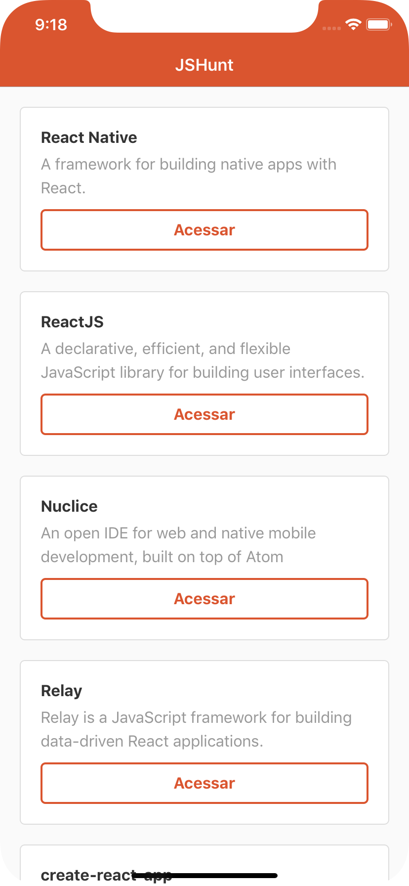
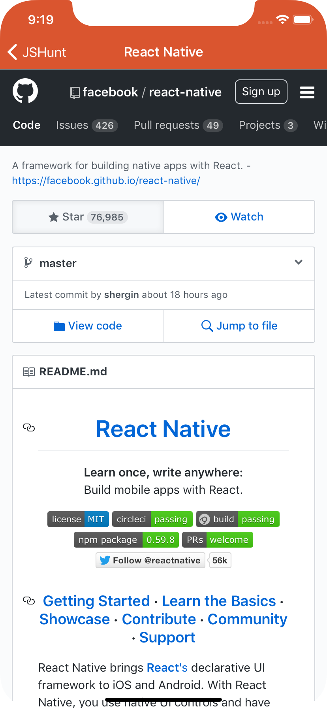

# Hunt App

This project is a small example of how to construct an application with React Native. This project developed through the course "React Native Starter by RocketSeat.". In this example was used the component: FlatList with Infinite Scroll, use the Axios library to access web service and WebView to show products.




## Getting Started

1. Follow [it](https://facebook.github.io/react-native/docs/getting-started.html) to install and to configure React Native in your localhost.

2. Clone this repository:
```
git clone https://github.com/juliafealves/huntapp.git
```

3. Insider project, execute:

```
react-native run-ios
```
or

```
react-native run-android
```
